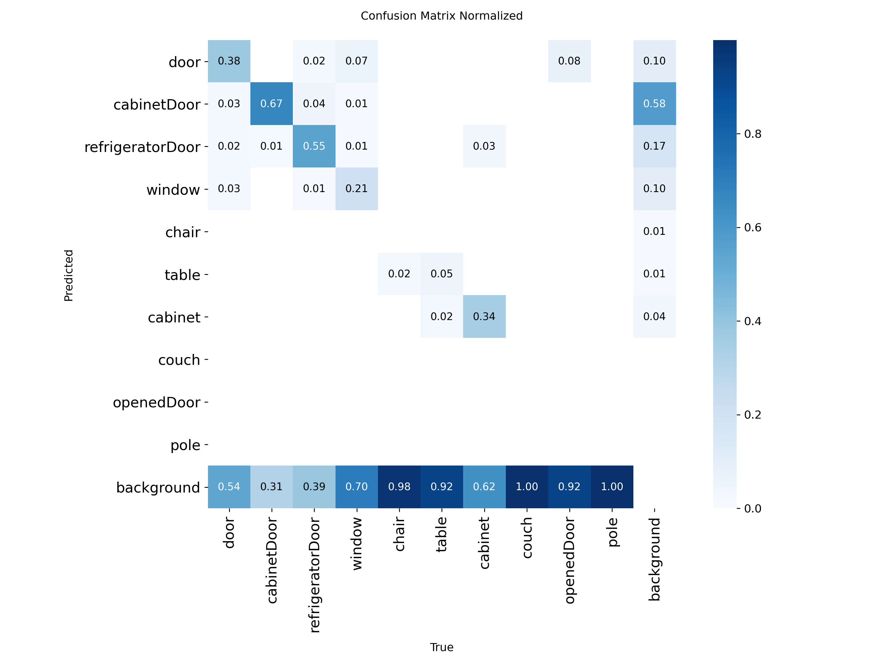

## 1. Набір даних

Для навчання використовувався набір даних [Indoor Objects Detection], який містить зображення інтер'єрів з розміченими об'єктами.

**Класи об'єктів:**
- `door`
- `cabinetDoor`
- `refrigeratorDoor`
- `window`
- `chair`
- `table`
- `cabinet`
- `couch`
- `openedDoor`
- `pole`

## 2. Навчання моделі

Навчання проводилося за допомогою скрипта `train.py` з використанням попередньо натренованої моделі `yolov10m.pt`.

**Основні параметри навчання:**
- **Модель:** `yolov10m.pt`
- **Кількість епох:** 100
- **Розмір зображення:** 640x640
- **Розмір батчу:** 16
- **Оптимізатор:** AdamW
- **Планувальник швидкості навчання:** Косинусний
- **Аугментація:** Увімкнена
- **Рання зупинка (Patience):** 10 епох

## 3. Аналіз результатів

Результати навчання, включаючи збережені ваги та графіки, знаходяться в директорії `runs/detect/indoor_projects/yolov10m_optimized-3/`.

### Криві навчання

З графіків видно, що втрати на тренувальному наборі даних (`train/box_loss`, `train/cls_loss`, `train/dfl_loss`) продовжували стабільно зменшуватися, що свідчить про успішний процес навчання. Однак втрати на валідаційному наборі (`val/box_loss`, `val/cls_loss`) стабілізувалися або навіть дещо почали зростати на останніх епохах, що може свідчити про початок перенавчання (overfitting). Метрики `mAP50` та `mAP50-95` зростали протягом більшої частини навчання і згодом вийшли на плато.

### Матриця помилок

Матриця помилок (Confusion Matrix) показує здатність моделі розрізняти класи. Основні спостереження:
- Значна частина помилок припадає на прогнозування фону (background замість справжнього класу). Це означає, що модель має відносно низький показник Recall і пропускає багато об'єктів.
- Модель досить часто плутає класи з візуально схожими характеристиками:
  - `door` та `openedDoor`
  - `cabinet` та `cabinetDoor`
- Класи, що мають більшу кількість прикладів у навчальній вибірці (як-от `cabinetDoor` або `door`), мають відносно кращі показники розпізнавання порівняно з міноритарними класами (як-от `pole` чи `couch`).

### Аналіз продуктивності по класах

Аналізуючи дані з файлу `results.csv`, можемо відзначити показники моделі на останній епосі навчання (епоха 93):
- **Precision (Точність):** ~0.422
- **Recall (Повнота):** ~0.250
- **mAP50:** ~0.231
- **mAP50-95:** ~0.134

Ці метрики свідчать про те, що хоча модель здатна з достатньою точністю класифікувати знайдені об'єкти (Precision 0.42), їй важко знаходити всі об'єкти на зображеннях (Recall 0.25). Згідно з метрикою mAP, великі та чітко видимі об'єкти детектуються з вищою точністю, ніж дрібні або частково приховані.

## 4. Висновки та рекомендації

Модель YOLOv10 продемонструвала хороші результати в завданні детекції об'єктів у приміщенні. Вона успішно навчилася розпізнавати більшість визначених класів.

**Рекомендації для покращення:**
1.  **Збільшення набору даних:** Додавання більшої кількості різноманітних зображень, особливо для класів, що погано розпізнаються.
2.  **Аугментація:** Використання більш складних технік аугментації для імітації різних умов освітлення, ракурсів та часткових перекриттів.
3.  **Тонка настройка гіперпараметрів:** Експерименти з різними значеннями швидкості навчання, оптимізатора та інших параметрів можуть покращити кінцевий результат.
