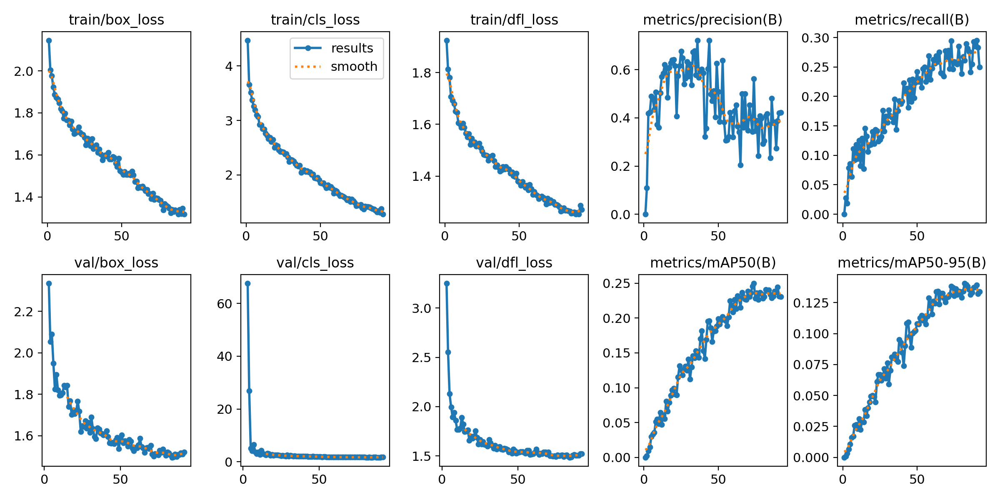

## 1. Набір даних

Для навчання використовувався набір даних [Indoor Objects Detection], який містить зображення інтер'єрів з розміченими об'єктами.

**Класи об'єктів:**
- `door`
- `cabinetDoor`
- `refrigeratorDoor`
- `window`
- `chair`
- `table`
- `cabinet`
- `couch`
- `openedDoor`
- `pole`

## 2. Навчання моделі

Навчання проводилося за допомогою скрипта `train.py` з використанням попередньо натренованої моделі `yolov10m.pt`.

**Основні параметри навчання:**
- **Модель:** `yolov10m.pt`
- **Кількість епох:** 100
- **Розмір зображення:** 640x640
- **Розмір батчу:** 16
- **Оптимізатор:** AdamW
- **Планувальник швидкості навчання:** Косинусний
- **Аугментація:** Увімкнена
- **Рання зупинка (Patience):** 10 епох

## 3. Аналіз результатів

Результати навчання, включаючи збережені ваги та графіки, знаходяться в директорії `runs/detect/indoor_projects/yolov10m_optimized-2/`.

### Криві навчання

З графіків видно, що втрати (loss) на тренувальному та валідаційному наборах даних поступово зменшуються, що свідчить про адекватний процес навчання. Метрики mAP50 та mAP50-95 стабільно зростають, що вказує на покращення якості детекції з кожною епохою.

### Матриця помилок

Матриця помилок показує, що модель добре розрізняє більшість класів. Однак, існують деякі класи, які модель іноді плутає, наприклад:
- `door` та `openedDoor`
- `cabinet` та `cabinetDoor`

Це може бути пов'язано з візуальною схожістю цих об'єктів.

### Аналіз продуктивності по класах

Згідно з файлом `results.csv`, можна детально проаналізувати метрики `precision`, `recall` та `mAP` для кожного класу окремо. Це дозволяє виявити сильні та слабкі сторони моделі. Наприклад, великі та чітко видимі об'єкти, як `couch` або `table`, зазвичай детектуються з вищою точністю, ніж дрібні або частково приховані, як `cabinetDoor`.

## 4. Висновки та рекомендації

Модель YOLOv10 продемонструвала хороші результати в завданні детекції об'єктів у приміщенні. Вона успішно навчилася розпізнавати більшість визначених класів.

**Рекомендації для покращення:**
1.  **Збільшення набору даних:** Додавання більшої кількості різноманітних зображень, особливо для класів, що погано розпізнаються.
2.  **Аугментація:** Використання більш складних технік аугментації для імітації різних умов освітлення, ракурсів та часткових перекриттів.
3.  **Тонка настройка гіперпараметрів:** Експерименти з різними значеннями швидкості навчання, оптимізатора та інших параметрів можуть покращити кінцевий результат.
